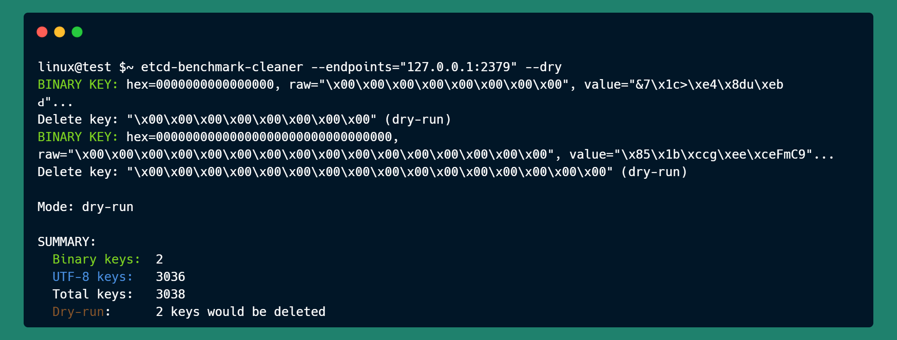

# ETCD Benchmark Cleaner

A lightweight CLI tool to **scan**, **detect**, and optionally **remove benchmark or non-UTF8 keys** from your etcd key-value store.

> ⚠️ Note: This utility was built as an extension because the official [`etcd benchmark tool`](https://github.com/etcd-io/etcd/blob/main/tools/benchmark/README.md) does **not include any built-in `clean` command** or ability to manage invalid/benchmark keys directly.

---

## Features

- Scan keys under a specified **hex-encoded prefix**
- Detect benchmark or invalid UTF-8 keys
- Supports **dry-run mode** for safe validation
- Secure connection via TLS/mTLS
- Clear, color-coded terminal output for easy inspection

---

## 🔧 Installation

Clone and build the project locally:

```bash
git clone https://github.com/nh4ttruong/etcd-benchmark-cleaner.git
cd etcd-benchmark-cleaner
go build -o etcd-benchmark-cleaner
```

Or run directly:

```bash
go run clean.go [flags]
```

---

## Usage

```bash
./etcd-benchmark-cleaner [flags]
    Usage of etcd-benchmark-cleaner:
        --cacert string
                Path to trusted CA file (default $ETCDCTL_CACERT)
        --cert string
                Path to client certificate (default $ETCDCTL_CERT)
        --debug
                Print UTF-8 keys and values
        --dry
                Dry-run mode (simulates deletion)
        --endpoints string
                Comma-separated list of etcd endpoints (default $ETCDCTL_ENDPOINTS)
        --key string
                Path to client private key (default $ETCDCTL_KEY)
        --prefix string
                Hexadecimal prefix of keys to scan
        --remove
                Delete binary keys
        --timeout duration
                Request timeout (default 5s)
```

Flags to run `etcd-benchmark-cleaner`:

| Flag          | Default           | Description                                                     |
| ------------- | ----------------- | --------------------------------------------------------------- |
| `--endpoints` | localhost:2379    | Comma-separated list of etcd endpoints **(required)**           |
| `--prefix`    | "" (all)          | **Hex-encoded** prefix of keys to scan (e.g., `02`, `74657374`) |
| `--cacert`    | `$ETCDCTL_CACERT` | Path to CA file (or set `$ETCDCTL_CACERT`)                      |
| `--cert`      | `$ETCDCTL_CERT`   | Path to client cert (or set `$ETCDCTL_CERT`)                    |
| `--key`       | `$ETCDCTL_KEY`    | Path to client key (or set `$ETCDCTL_KEY`)                      |
| `--debug`     | _N/A_             | Print raw UTF-8 keys and values                                 |
| `--dry`       | _N/A_             | Simulate deletion without making changes                        |
| `--remove`    | _N/A_             | Actually delete benchmark keys (caution)                        |
| `--timeout`   | 5s                | Request timeout (default: `5s`)                                 |


## Examples

### Scan all keys for benchmark entries

```bash
./etcd-benchmark-cleaner --endpoints=https://127.0.0.1:2379
```


### can keys with a benchmark prefix (`0x00`)

```bash
./etcd-benchmark-cleaner --endpoints=https://127.0.0.1:2379 --prefix 00
```


### Dry-run deletion of benchmark keys (no changes made)

```bash
./etcd-benchmark-cleaner --endpoints=https://127.0.0.1:2379 --prefix 02 --dry
```



### Actually delete benchmark keys (irreversible)

```bash
./etcd-benchmark-cleaner --endpoints=https://127.0.0.1:2379 --remove
```


---

## 🔐 TLS Support

If your etcd cluster uses TLS, provide the following flags:

```bash
--cacert path/to/ca.crt
--cert   path/to/client.crt
--key    path/to/client.key
```

Or set them as environment variables:

```bash
export ETCDCTL_CACERT=...
export ETCDCTL_CERT=...
export ETCDCTL_KEY=...
```

## Note

- Always run with `--dry` first before using `--remove`
- Ensure your prefix is correct and **hex-encoded**
- Backup etcd or test against a dev cluster before destructive operations
